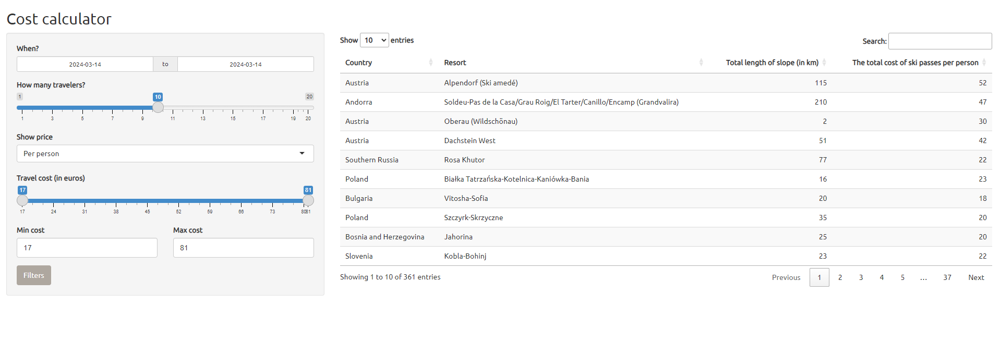
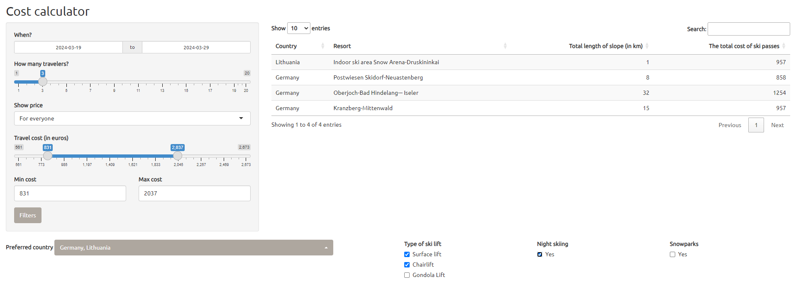

# Ski price calculator

An interactive Shiny application written in R, enabling users to calculate the costs of purchasing ski passes in European resorts. It allows filtering by resort size, prices, number of skiers, and preferred countries.

### The main panel

The main panel of the application with basic filtering options such as selecting the date, number of people, and cost limitations.

### Additional options

Upon pressing the "Filters" button, users have the choice of additional data filtering options.

The appearance of the application for sample data.

## How to run the application?
You can test the online cost calculator : [https://dmnk0811.shinyapps.io/Ski_Projects/](https://dmnk0811.shinyapps.io/Ski_Projects/)

## Data
The data used in the project:  
- [European ski resorts](https://www.kaggle.com/code/svitlanabozhenko/european-ski-resorts/comments)

## Technologies

The application was written in RStudio using the R language and the Shiny library. Additionally, the dplyr package was used for data frame manipulation, while shinyWidgets were employed for additional functionalities.

## In the future:

Additional tab where you'll be able to check technical information about the resort you're interested in: highest elevation point, percentage shares of ski slopes of a given difficulty level compared to the whole, etc.

